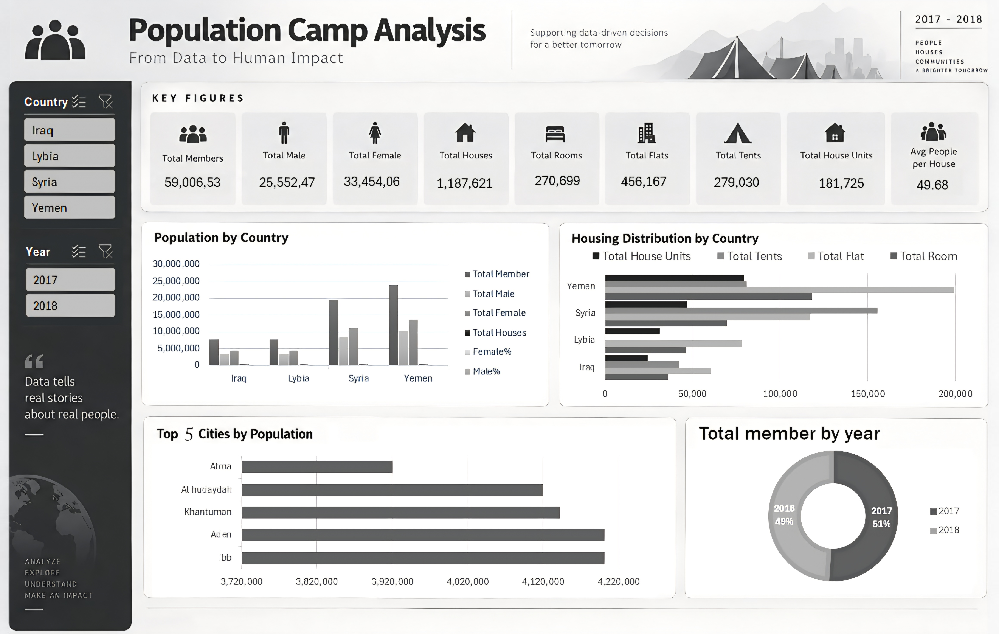

# Population Camp Analysis

End-to-end data analysis of a humanitarian dataset tracking housing and demographic conditions across displaced population sites in Iraq, Libya, Syria, and Yemen (Jan 2017 – Nov 2018): Python-based cleaning, followed by an Excel Power Pivot data model, DAX measures, PivotTables, and an interactive dashboard.

> **Note on the repository name:** this README uses the project's new title, "Population Camp Analysis." The connected GitHub integration doesn't expose a repository-rename action, so the actual rename to `Population-Camp-Analysis` needs to be done manually: go to this repo's **Settings → repository name**, change it, and click Rename. GitHub automatically redirects the old URL afterward, so nothing that links here will break.

## Project Overview

This project analyzes displaced-population camp data to understand how population, gender balance, and housing conditions vary across four countries — **Iraq, Libya, Syria, and Yemen** — and over time. The goal is to surface which countries and cities carry the largest displaced populations, which housing types dominate in each country, and how the population changed between 2017 and 2018 — information relevant to prioritizing humanitarian resources.

The original assignment brief called for the initial cleaning step to be done in Excel (Power Query). That step was instead completed in Python; Excel was used for the subsequent analysis and dashboard workflow. See [Project Workflow](#project-workflow) below.

## Project Workflow

1. **Data Cleaning & Preprocessing** — Python (`scripts/data_cleaning.py`)
2. **Exploratory Data Analysis** — Python (`notebooks/displaced_population_analysis.ipynb`)
3. **PivotTables & KPI Development** — Excel
4. **Power Pivot & DAX Measures** — Excel
5. **Dashboard Development** — Excel
6. **Analytical Questions & Insights** — `analysis/analytical_insights.md`

## Dataset

- 9,917 records across **Iraq, Libya, Syria, and Yemen**
- Time range: January 2017 – November 2018
- Columns: `Date`, `Country`, `City`, `PlaceName`, `Houses`, `Members`, `Male`, `Female`, and housing-type counts `Room`, `Flat`, `House`, `Tent`

## Data Cleaning & Preprocessing

Data was cleaned and preprocessed **using Python (pandas, NumPy)** — not Excel. This is a deliberate deviation from the original assignment brief, which specified Excel/Power Query for this step. The cleaning script (`scripts/data_cleaning.py`) performs:

- Parsing `Date` to datetime, coercing invalid values to null
- Converting `Country`, `City`, `PlaceName` to pandas' `string` dtype, and `Members`, `Male`, `Female`, `Room`, `Flat`, `House`, `Tent` to nullable numeric (`Int64`) types, coercing invalid values to null
- Standardizing text columns (`Country`, `City`, `PlaceName`) by stripping whitespace and capitalizing
- Filling missing values in the housing columns (`Room`, `Flat`, `House`, `Tent`) with 0 — a blank in these fields represents zero units of that housing type, not a statistical placeholder
- Removing fully-empty rows and exact duplicate rows
- Adding a `Member_Validation` column flagging whether `Members` equals `Male + Female` ("OK"/"Review")
- Deriving `Year` and `Month` (month name) fields from `Date`
- Exporting the cleaned dataset to Excel for the subsequent Power Pivot/DAX/dashboard workflow

Excel was used **only** for the analysis and reporting layer that follows — not for cleaning the data.

## Exploratory Data Analysis (Python)

A separate notebook (`notebooks/displaced_population_analysis.ipynb`) performs additional exploratory analysis on the dataset:

- Structural diagnostics (`df.info()`, `df.describe()`) to profile the columns
- Grouping and pivoting by country, and by country × year
- Min-Max scaling and Z-score standardization of `Houses`, `Members`, and `Avg_People_Per_House`
- Outlier detection using a |Z| > 3 threshold
- Visualizations: total members by country (bar), total members by year and country (line), male/female percentage distributions (KDE), houses-vs-members relationship (regression plot), and a correlation heatmap

## PivotTables / KPIs (Excel — Power Pivot & DAX)

The cleaned data was modeled in Excel using Power Pivot, with DAX measures built for the dashboard:

- `Total Members`, `Total Male`, `Total Female`, `Total Houses`
- `Total Rooms`, `Total Flats`, `Total House Units`, `Total Tents`
- `Male %`, `Female %` (via `DIVIDE`, to avoid division-by-zero)
- `Avg People per House`

PivotTables were built for a country summary, a yearly trend, housing distribution by country, and a top-cities ranking. Full KPI values and the country/year/city breakdowns are documented in [`dashboard/README.md`](dashboard/README.md).

## Dashboard

The Excel dashboard ("Population Camp Analysis — From Data to Human Impact") brings the PivotTables together into:



- KPI cards for the totals and averages above
- A clustered column chart of population by country
- A grouped bar chart of housing distribution by country
- A horizontal bar chart of the top 5 cities by population
- A donut chart of total members by year (2017 vs. 2018)
- Country and Year slicers connected to every visual

See [`dashboard/README.md`](dashboard/README.md) for the full KPI tables and breakdowns read from the workbook.

## Key Insights

From the Step 6 analysis of the dashboard (full write-up in [`analysis/analytical_insights.md`](analysis/analytical_insights.md)):

- Yemen has the highest total population (23,960,127), followed by Syria — together these two countries account for the large majority of the displaced population in this dataset
- Libya has the highest female percentage (~56.9%)
- Flats are the dominant housing type in Yemen, Libya, and Iraq; Syria is the exception, where tents dominate — pointing to less stable housing conditions there
- Total population declined slightly between 2017 (~30.1M) and 2018 (~28.9M), which may reflect displaced people beginning to return home
- The average of 49.68 people per house across the dataset indicates severe overcrowding
- The five largest cities by population are Ibb, Aden, Khantuman, Al Hudaydah, and Atma

## Tools & Technologies

- **Python** — Pandas, NumPy, Matplotlib, Seaborn, Scikit-learn (data cleaning, preprocessing, exploratory analysis)
- **Excel** — Power Query, Power Pivot, DAX, PivotTables/PivotCharts (data modeling, KPI measures, interactive dashboard)

## Project Structure

```
Population-Camp-Analysis/
│
├── README.md
├── scripts/
│   └── data_cleaning.py                      # Python data cleaning & preprocessing (source of truth)
├── notebooks/
│   └── displaced_population_analysis.ipynb   # Exploratory analysis: scaling, outliers, visualization
├── analysis/
│   └── analytical_insights.md                # Step 6 dashboard findings & interpretation
└── dashboard/
    ├── README.md                             # Dashboard KPIs, breakdowns, and visuals
    └── dashboard.png                         # Dashboard screenshot (add manually — see note below)
```

The exploratory notebook was originally developed in Google Colab; it contains the complete, unmodified code (grouping/pivoting → scaling & outlier detection → visualization). Cell outputs (charts/tables) were stripped from this file to keep it under GitHub's direct-upload size limit; run the notebook to regenerate them.

The final Excel workbook (cleaned data, Power Pivot model, PivotTables, and dashboard) is not included directly in this repository — see the note in [`dashboard/README.md`](dashboard/README.md) for why and how to add it yourself if you'd like it included.

**Note on the dashboard image:** `dashboard/dashboard.png` needs to be added manually — see [`dashboard/README.md`](dashboard/README.md) for details.

## Skills Demonstrated

Data Cleaning, Data Preprocessing, Exploratory Data Analysis, Data Aggregation & Pivoting, Feature Scaling, Outlier Detection, Data Visualization, Power Query, Power Pivot & DAX, Dashboard Design, KPI Reporting
